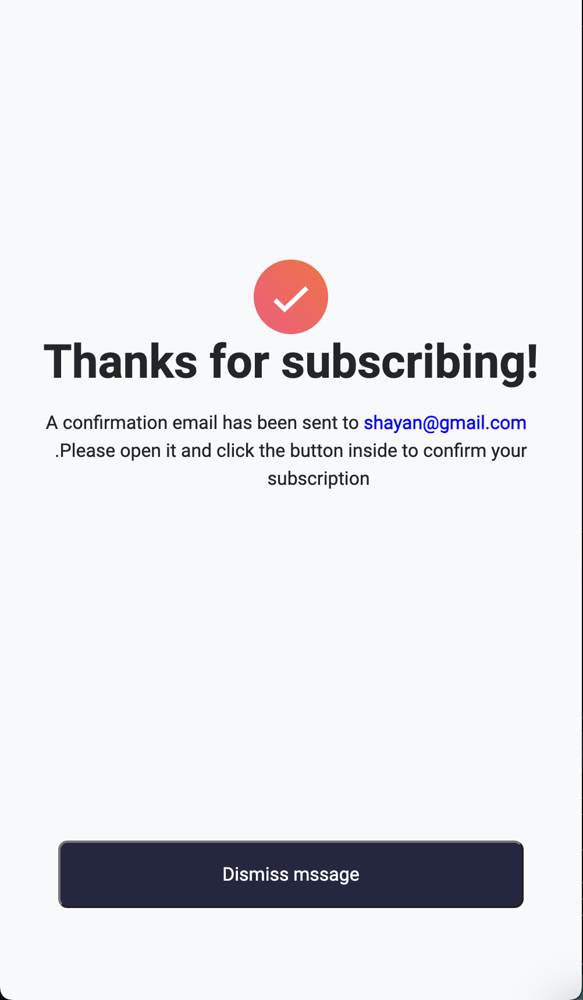

# Frontend Mentor - Newsletter sign-up form with success message solution

This is a solution to the [Newsletter sign-up form with success message challenge on Frontend Mentor](https://www.frontendmentor.io/challenges/newsletter-signup-form-with-success-message-3FC1AZbNrv). 

## Table of contents

- [Overview](#overview)
  - [The challenge](#the-challenge)
  - [Screenshot](#screenshot)
  - [Links](#links)
- [My process](#my-process)
  - [Built with](#built-with)
  - [What I learned](#what-i-learned)
- [Author](#author)

## Overview

### The challenge

Users should be able to:

- Add their email and submit the form
- See a success message with their email after successfully submitting the form
- See form validation messages if:
  - The field is left empty
  - The email address is not formatted correctly
- View the optimal layout for the interface depending on their device's screen size
- See hover and focus states for all interactive elements on the page

### Screenshot

Index page

Success page

Index page in mobile

Success page in mobile

### Links

- Solution URL: [Click to view](https://www.frontendmentor.io/solutions/designed-front-with-css-and-bootstrap-5U5fga1hE3)
- Live Site URL: [Click to view](https://newsletter-sign-up-with-success-message-main-amber.vercel.app/)

## My process

### Built with

- Semantic HTML5 markup
- CSS custom properties
- Flexbox
- Bootstrap 4 
- JavaScript

### What I learned
If you want to learn Ajax or Js that how to store a variable and use it in another page this project can help you 

## Author

- Website - [Shayan Hosseinzadeh](https://www.shayandev.ir)
- Frontend Mentor - [@ShayanHosseinzadeh](https://www.frontendmentor.io/profile/ShayanHosseinzadeh)

